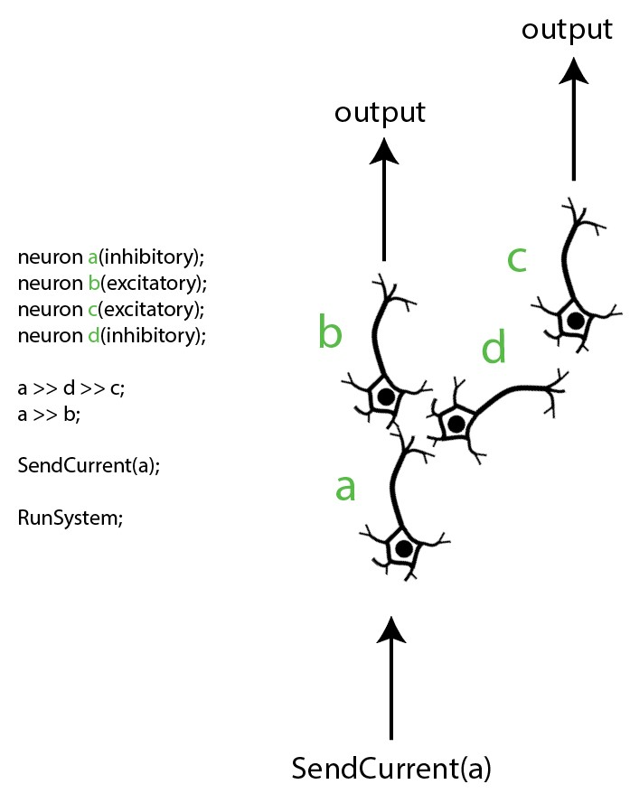

# CENS language
CENS language (CEntral Nervous System Language) is a project aiming to be a programming language that simulates a neuron system environment. This is also a final project for the compiler course. This repository accepts pull requests.<br>
**Note:** This project is completed.

# Getting started
The following steps guide you to compile and run a demo code.

## 1. Compile CENS
On same directory of **main.cpp** execute:
```bash
  $ c++ -std=c++17 main.cpp -o cens.exe
  ```
## 2. Code your idea
You are free to code and always respect grammar (see language reference). There are 4 important parts that your code has to have.  There is a demo in the final part.

#### 2.1 Create neurons
A **neuron** keyword is imperative. Then, you have to choose a name and define if it shall be inhibitory or excitatory. i.e.

> neuron name_of_neuron1 (inhibitory);<br>
> neuron name_of_neuron2 (excitatory);

#### 2.2 Innervate neuron among them
A **>>** symbol  mean the left neuron innervate right neuron. The following example mean that my_neuron_1 innervate my_neuron_2. 

> my_neuron_1 >> my_neuron_2

And this that my_neuron_1 innervate my_neuron_2, and my_neuron_2 innervate my_neuron_3.

> my_neuron_1 >> my_neuron_2 >> > my_neuron_3
#### 2.3 Define which neurons you stimulate
You have to put as many neurons as parameters you need to be stimulated. i.e.

> SendCurrent(my_neuron_1, my_neuron_2,my_neuron_3);

#### 2.4 Run simulation
You must be sure that this instruction shall be the final instruction. i.e.

> RunSystem;

## 3. Run CENS
Your have some options to compile.

#### 3.1 Default mode
If you choose this mode. You have to name your file with your code **in_file.txt**. You shall have the output file with the name **out_file.txt**. And you shall not see any couts from the compiler. Maybe, this is the most common mode and that you shall want to use. Any error will prompt.
```bash
  $ ./cens.exe -default
  ```

#### 3.2 Custom mode
If you choose this mode. You have to specify the name of your file with your code. Optionally you can specify the output file with a **-o** command (otherwise shall be out_file.txt) and/or with **-debug** say the compiler that prints full couts. Any error will prompt (and with a lot of details if you put **-debug**).
```bash
  $ ./cens.exe -i my_program.txt -o other_file.txt -debug
  ```

#### 3.3 Developer mode
With the aim to minimize write commands time. This mode considers **in_file.txt** like input code. **out_file.txt** like output file. And **-debug** is considered.
```bash
  $ ./cens.exe -dev
  ```

# Language Reference

## LL1 grammar:
goal => expr<br>
expr => define ; expr'<br>
expr => innervate ; expr'<br>
expr => input ; expr'<br>
expr => start ;<br>
expr' => define ; expr'<br>
expr' => innervate ; expr'<br>
expr' => input ; expr'<br>
expr' => <br>
define => neuron id ( param_d )<br>
param_d => inhibitory param_d'<br>
param_d => excitatory param_d'<br>
param_d' => , num<br>
param_d' => <br>
innervate => id >> id innervate'<br>
innervate' => >> id innervate'<br>
innervate' => <br>
input => SendCurrent ( id param_i )<br>
param_i => , id param_i<br>
param_i => <br>
start => RunSystem<br>

## Lexical analysis

### Line structure

* Lines finish with a “;” like c++ language.
* Comments is possible 2 ways:
	* Multi line comment /* comments */
	* Single comment using // comment
* Since lines finish with “;”. Lines could be composed of more than 1 line.
* A logical line that contains only spaces, tabs and possibly a comment, is ignored.
* The whitespace characters space and tab can be used interchangeably to separate tokens.

###  Tokens

##### Identifiers
Identifiers are formed by the following regular expressions:
>letter  => [A-Za-z]<br>
digit    =>[0-9]<br>
identifier => (letter)(letter|digit)*

##### Keywords
The following identifiers are used as reserved words of the language, and cannot be used as ordinary identifiers. They must be spelled exactly as written here:
>"system", "run", "neuron", "glia", "glutamate", "acetylcholine", "norepinephrine", "gaba", "atp", "adenosine", "if", "else", "for" and "while".

##### Literals
Following the regular expression:
> ascii  => Any ASCII character except "\" or newline or the quote.<br>
literal  => ascii*

##### Operators
Available operators:
> ">>" mean innervate

##### Delimiters
Available delimiters:
>"{", "}", "(", ")" and ";"

###  Compound statements

1. class neuron statement
2. SendCurrent statement
3. RunSystem statement

###  Usage on terminal
```bash
Instructions:
        cens.exe <commands> <optional>
Commands:
        -default                 Consider in_file.txt out_file.txt. No full print.
                                 Not necessary other commands or optional.
        -dev                     Default files names + full print.
                                 Not necessary other commands or optional.
        -i [input_file]          To define input file with CENS code.
        -o [output_file]         To define output file with tokens and lexemas.
Optional:
        -debug                   Print couts of arrays.
```

# Demo

After compile CENS. You can execute this:
> ./cens.exe -i in_file.txt -o out_file.txt

or:

> ./cens.exe -default

The below image show graphically the demo:


# TODO

- Support to automatic millions neurons creation
- Parallelism on stimulation input
